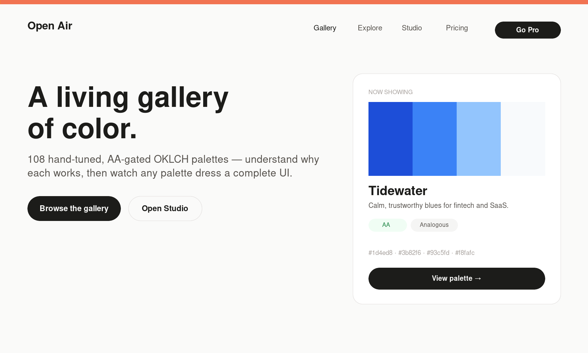
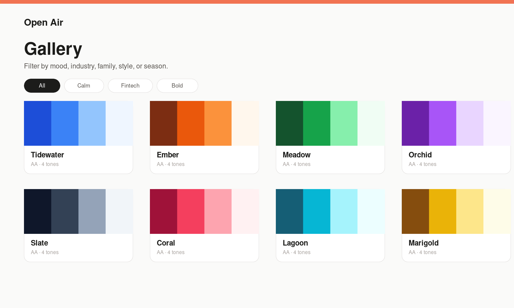
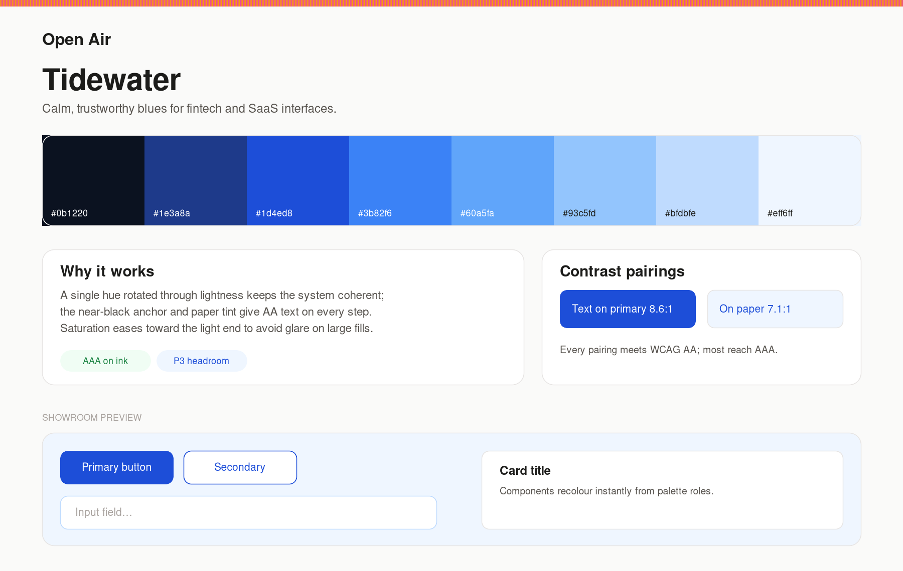
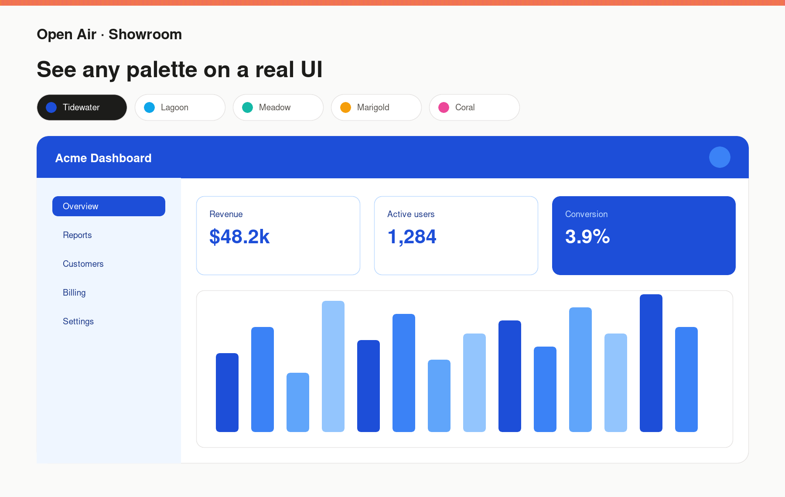
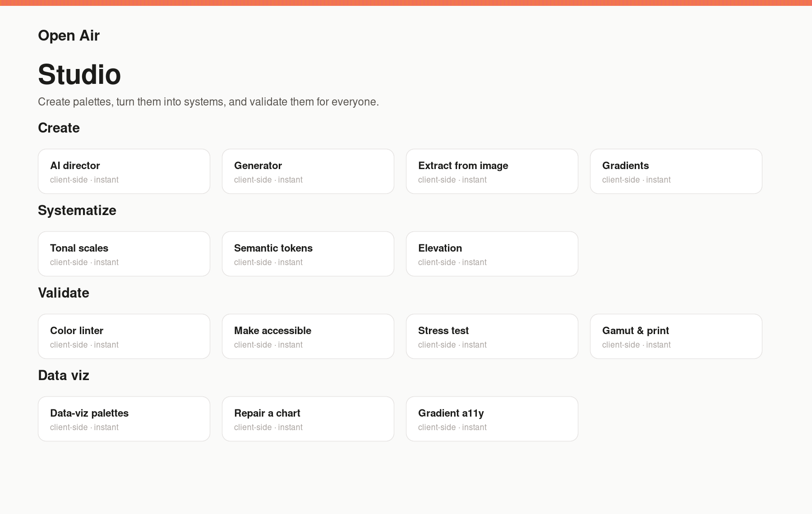
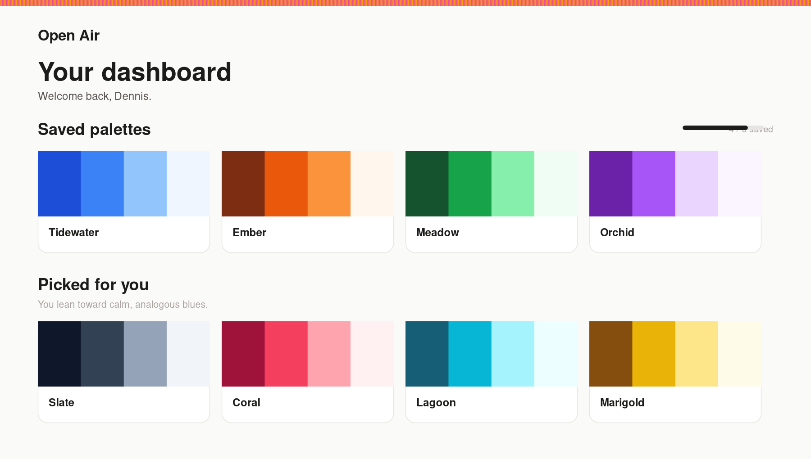
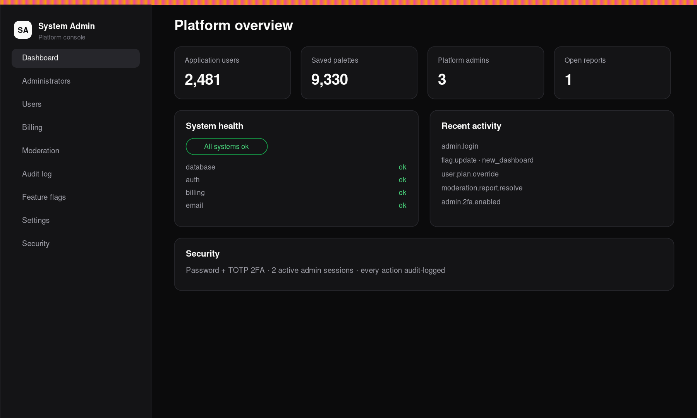
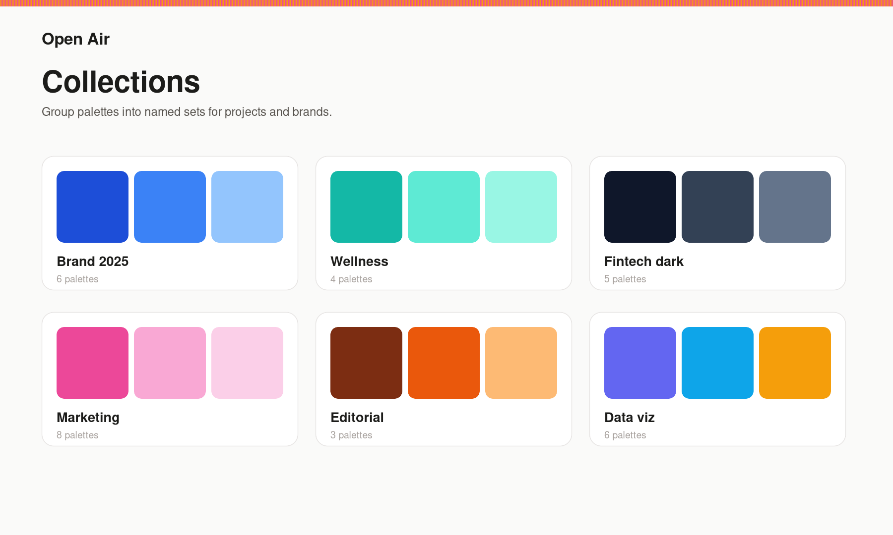
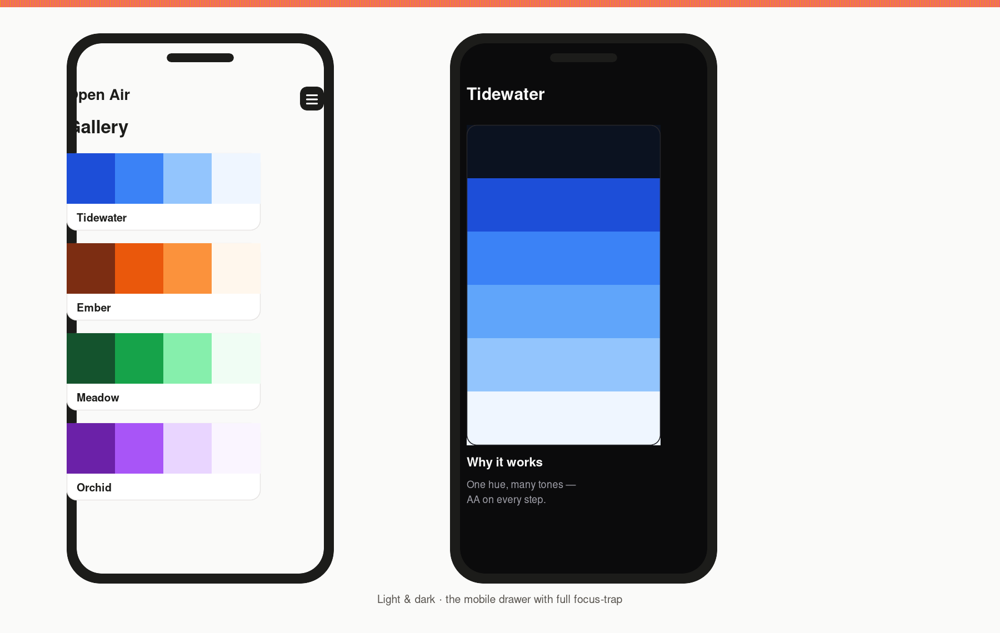

<div align="center">


# Open Air

**A living gallery of color — the platform to create, validate, govern, and ship production-ready color systems.**

Browse **108** hand-tuned, AA-gated OKLCH palettes, understand *why* each one works, build complete token systems in the **Studio**, watch any palette dress a full UI in the **Showroom**, publish to a community, and govern shared brand kits as a team.

<br />


[**Getting Started**](docs/getting-started.md) · [**Documentation**](#-documentation) · [**Architecture**](docs/architecture.md) · [**API**](docs/api.md) · [**Report a bug**](https://github.com/dennis-mmachoene/open-air/issues)

</div>

<br />



---

## Table of contents

- [Overview](#-overview)
- [Features](#-features)
- [Screenshots](#-screenshots)
- [Quick start](#-quick-start)
- [Tech stack](#-tech-stack)
- [Architecture](#-architecture)
- [Documentation](#-documentation)
- [Scripts](#-scripts)
- [Contributing](#-contributing)
- [License](#-license)

---

##  Overview

Open Air is a premium color-exploration **platform** built around three pillars:

- **System** — the **Studio** (AI director, tonal scales, semantic tokens, gradients, linter, …) and the **Showroom**, which re-themes a whole UI from `--p-*` role tokens.
- **Guarantee** — accessibility everywhere: AA/AAA contrast, color-vision-deficiency simulation, wide-gamut/print, and a color linter.
- **Govern** — a **community** (publish, follow, like, comment) and **teams** (orgs, roles, shared brand kits, a review workflow, verified domains, audit logs) — under an isolated **System Administrator** plane.

> **Zero config to explore.** The app boots with no environment variables — the public gallery runs entirely off a static `snapshot.json` of 108 palettes. Add credentials to unlock accounts, billing, AI, and admin.

---

##  Features

| | Feature | What it does |
|---|---|---|
|  | **Gallery** | A quiet, near-neutral shell so every saturated pixel belongs to a palette. Filter by mood, industry, family, style, or season; open any palette for its ramp, harmony, contrast pairings, and rationale. |
|  | **Showroom** | One click re-themes an entire UI specimen library — primitives, components, data-viz, full screens — driven purely by role tokens. |
|  | **Studio** | 14 client-side tools across **Create · Systematize · Validate · Data-viz**: generate, extract, scales, tokens, elevation, **linter**, stress test, gamut & print, and more. |
|  | **Teams** | Organizations with roles & seats, shared **brand kits**, a **propose → review → approve** workflow, verified domains with auto-join, and a per-tenant audit log + export. |
|  | **Live sync & API** | Serve a brand kit as design tokens (DTCG/CSS/SCSS/Tailwind/JSON) with ETag polling; a public palette API with keys + rate limiting. |
|  | **System Admin** | An isolated `/sys` console: scrypt credentials + **TOTP 2FA**, audit log, feature flags, user/billing oversight, moderation. |
|  | **Billing** | Free / Pro / Studio via Stripe, with entitlements derived **server-side** from the plan. |

---

##  Screenshots

<table>
  <tr>
    <td width="50%"><br/><sub><b>Gallery</b> — filterable, AA-gated catalog</sub></td>
    <td width="50%"><br/><sub><b>Palette</b> — ramp, why it works, contrast</sub></td>
  </tr>
  <tr>
    <td><br/><sub><b>Showroom</b> — any palette on a real UI</sub></td>
    <td><br/><sub><b>Studio</b> — tools, categorized</sub></td>
  </tr>
  <tr>
    <td><br/><sub><b>Dashboard</b> — content-first</sub></td>
    <td><br/><sub><b>/sys</b> — isolated admin console (dark)</sub></td>
  </tr>
  <tr>
    <td><br/><sub><b>Collections</b> — named sets</sub></td>
    <td><br/><sub><b>Mobile</b> — light &amp; dark</sub></td>
  </tr>
</table>

---

##  Quick start

**Prerequisites:** Node **22+** and npm.

```bash
# 1. Run it — zero config (static catalog, all Studio tools)
npm ci && npm run dev          # → http://localhost:3000

# 2. Full app (accounts, teams, admin)
cp .env.example .env.local     # then edit — see docs/environment.md
npm run db:migrate             # apply migrations 0000–0014
npm run db:seed                # optional: load the catalog
npm run platform:admin -- create you@example.com "You"   # optional: /sys admin
npm run dev
```

Full walkthrough → **[docs/getting-started.md](docs/getting-started.md)** · every key → **[docs/environment.md](docs/environment.md)** & [SETUP-KEYS.md](SETUP-KEYS.md).

---

##  Tech stack

| Area | Choice |
|------|--------|
| **Framework** | Next.js 16 (App Router), React 19, TypeScript (strict) |
| **Styling** | Tailwind v4 (`@theme inline`, CSS role tokens) + a shared `components/ui` kit |
| **Color** | OKLCH via `culori`; WCAG AA/AAA contrast gating |
| **Data** | Drizzle ORM + Neon Postgres (migrations `0000`–`0014`) |
| **Auth** | Auth.js v5 (Google OAuth + magic links) · isolated `/sys` admin (scrypt + TOTP) |
| **Billing** | Stripe (Checkout, Billing Portal, idempotent webhooks) |
| **AI** | Google Gemini color director (REST, local fallback) |
| **Infra** | Upstash Redis (rate limits) · Nodemailer (SMTP) · PostHog · Sentry |
| **Tests / CI** | Vitest (unit + in-process Postgres integration) · GitHub Actions (lockfile → migrations → lint → typecheck → test → build) |

---

##  Architecture


Server-first routes over pure, tested `lib/` domain logic, with a static snapshot powering public reads. Deep dive → **[docs/architecture.md](docs/architecture.md)** · schema → **[docs/database.md](docs/database.md)**.

---

##  Documentation

| | Document | |
|---|---|---|
|  | [Getting Started](docs/getting-started.md) | Clone → running |
|  | [Environment](docs/environment.md) | Every variable |
|  | [Architecture](docs/architecture.md) | System design |
|  | [Database](docs/database.md) | Schema & migrations |
|  | [Authentication](docs/authentication.md) | Auth & the admin plane |
|  | [Security](docs/security.md) | Posture & trust boundaries |
|  | [API](docs/api.md) | Palette API & token sync |
|  | [Billing](docs/billing.md) | Plans, entitlements, Stripe |
|  | [Deployment](docs/deployment.md) | CI/CD & release checklist |
|  | [Accessibility](docs/accessibility.md) | The guarantee, in & out |
|  | [Performance