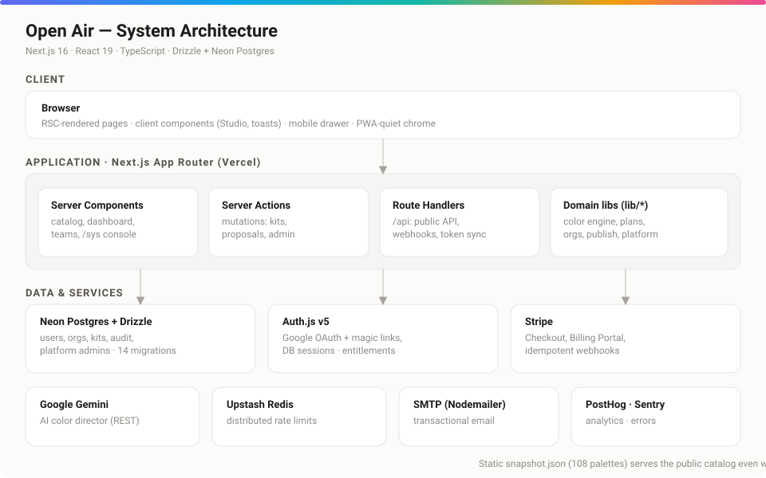
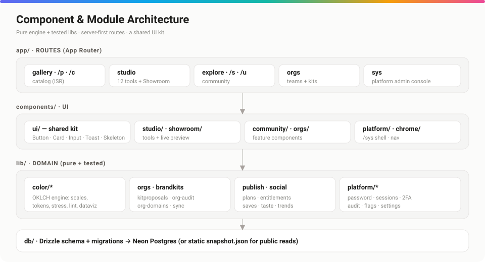
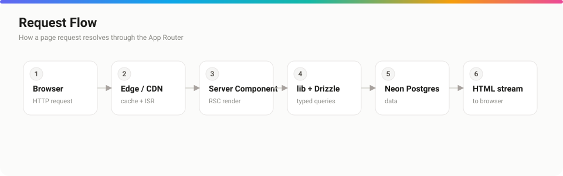

# Architecture

*How Open Air is structured — from the browser to the database — and the principles behind it.*

## Purpose

Give engineers a mental model of the system: the layers, where logic lives, how requests resolve, and the invariants that keep a large multi-tenant SaaS coherent.

## Overview

Open Air is a **server-first Next.js 16 application** (App Router, React 19, TypeScript strict) backed by **Drizzle ORM + Neon Postgres**. The public catalog renders from a static `snapshot.json`, so reads survive a database outage. Everything mutable — accounts, teams, community, billing, the admin plane — lives behind validated, role-checked server code.

The codebase follows one rule above all: **pure, tested domain logic in `lib/`; thin routes and components on top.**

## Detailed explanation

### Layers

- **`app/` — routes.** Server Components render pages (catalog, dashboard, teams, `/sys`). Server Actions perform mutations. Route Handlers under `app/api/*` serve the public API, the Stripe webhook, and the token-sync endpoint.
- **`components/` — UI.** A shared kit (`components/ui`: Button, Card, Input, Toast, Skeleton, …) sits under feature components (studio, community, orgs, platform, chrome).
- **`lib/` — domain.** The color engine (`lib/color/*`), plus `orgs`, `brandkits`, `kitproposals`, `publish`, `social`, `plans`, `entitlements`, and the isolated `platform/*` admin layer. These are framework-agnostic and unit/integration tested.
- **`db/` — persistence.** Drizzle schema + migrations against Neon Postgres. See [database.md](./database.md).

### Request flow

A page request hits Vercel's edge (cache + ISR), renders as a React Server Component, calls typed `lib` functions which issue Drizzle queries to Neon, and streams HTML back. Client components hydrate only where interactivity is needed (Studio tools, toasts, the mobile drawer).

### The three product pillars

- **System** — the Studio (generate, scales, tokens, gradients, linter, …) and the Showroom, which re-themes a whole UI from `--p-*` role tokens.
- **Guarantee** — accessibility (AA/AAA contrast, color-vision-deficiency simulation), wide-gamut/print, and the linter, applied everywhere.
- **Govern** — community (publish, follow, like, comment) and teams (orgs, roles, brand kits, a review workflow, verified domains, audit logs).

### The isolated platform plane

The **System Administrator** at `/sys` is a *separate authentication domain* — its own credential store (`platform_admins`, scrypt + TOTP), its own sessions, its own login. It never joins to the `users` table. See [authentication.md](./authentication.md) and [security.md](./security.md).

## Best practices

- **Put logic in `lib/`, not in components or routes.** Routes resolve auth/entitlements and delegate; components render.
- **Derive entitlements server-side** from `users.plan`; never trust the client.
- **Scope every org query by `orgId`** and check role via `requireRole`.
- **Add a test with the feature**, not after — the integration suite runs against an in-process Postgres (PGlite), so DB logic is testable without infrastructure.

## Notes & common pitfalls

- The static snapshot is the **source of truth for public reads**; regenerate it with `npm run palettes:snapshot` after catalog changes.
- Server Actions and Route Handlers both mutate — prefer Server Actions for form-driven UI and Route Handlers for programmatic/third-party access.
- The kit `Button` defaults to `type="button"`; native `<button>` in a `<form>` defaults to submit — don't blindly swap them.

## Related

- [database.md](./database.md) · schema & migrations
- [api.md](./api.md) · the public API & token sync
- [authentication.md](./authentication.md) · auth & the admin plane
- [performance.md](./performance.md) · ISR, caching, snapshots
