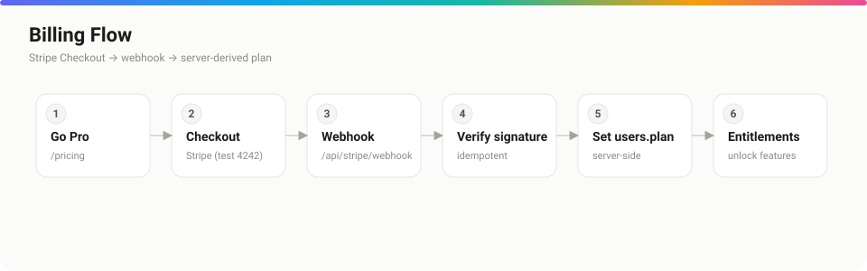

# Billing

*Plans, entitlements, and the Stripe integration.*



## Purpose

Explain how Open Air monetizes — the plan tiers, how entitlements gate features, and how Stripe is wired so the plan is always derived server-side.

## Overview

Plans are **Free**, **Pro**, and a legacy **Studio** tier. Billing is handled by Stripe (Checkout, Billing Portal, webhooks). The user's plan is **derived server-side from the Stripe subscription's price** — never trusted from the client — and stored on `users.plan`. Feature access flows from `getEntitlements()`.

## Detailed explanation

### Plans & entitlements

```ts
// lib/plans.ts (excerpt)
export const PLAN_FEATURES = {
  free:   { savedLimit: 5,   collections: false, generator: false, publish: false, teams: false, teamSeats: 0,  api: false },
  pro:    { savedLimit: null, collections: true,  generator: true,  publish: true,  teams: true,  teamSeats: 5,  api: true  },
  studio: { savedLimit: null, collections: true,  generator: true,  publish: true,  teams: true,  teamSeats: 25, api: true  },
};
```

```ts
// Server-side gate — the only source of truth
const ent = await getEntitlements(user.id);
if (!ent.publish) return <UpgradeCard feature="Publishing" />;
```

Pro unlocks unlimited saves, collections, the full Showroom, all export formats, the API, **publishing**, and **teams** (up to 5 seats; Studio: 25).

### Stripe setup

```bash
npm run stripe:setup   # creates products/prices, prints the price IDs
```

Paste the printed `STRIPE_PRICE_PRO_MONTHLY` / `STRIPE_PRICE_PRO_YEARLY` into `.env.local` (see [environment.md](./environment.md)).

### Checkout & webhook

The flow: **/pricing → Stripe Checkout → webhook → server sets `users.plan`**. The webhook lives at `/api/stripe/webhook` and is **idempotent** via a `webhook_events` table.

```bash
# Local development — forward webhooks
stripe login
stripe listen --forward-to localhost:3000/api/stripe/webhook
# copy the printed whsec_… into STRIPE_WEBHOOK_SECRET
```

Test card: `4242 4242 4242 4242`, any future expiry, any CVC.

### Team seats

Seat limits come from the **owner's** plan (`teamSeats`). `createOrg` requires the `teams` entitlement; `inviteMember` blocks once members + outstanding invites reach the cap. A `/sys` admin can override a user's plan for comping (audit-logged).

## Best practices

- Use **test-mode** Stripe keys outside production.
- Never set a plan from the client — let the webhook be the only writer of `users.plan`.
- Reconcile downgrades: surface an "over seat limit" prompt rather than silently breaking the team.

## Notes & common pitfalls

- **Missing `STRIPE_WEBHOOK_SECRET`** → the webhook can't verify signatures and billing won't update.
- The legacy `STRIPE_PRICE_STUDIO_*` vars are optional — only needed for existing Studio subscribers.
- Receipts require SMTP; without it, they're logged, not sent.

## Related

- [environment.md](./environment.md) · Stripe keys
- [authentication.md](./authentication.md) · plan → entitlements on sign-in
- [api.md](./api.md) · which plans unlock the API
- [security.md](./security.md) · server-derived authorization
