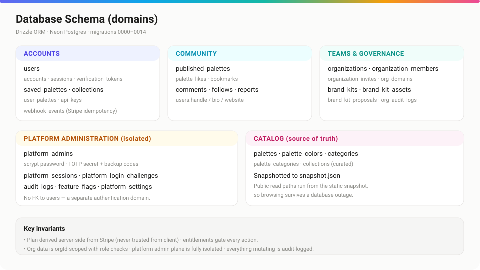

# Database

*The Drizzle schema, migration workflow, and the data-integrity invariants.*



## Purpose

Describe the persistence layer: how the schema is organized by domain, how migrations work, and the rules that keep multi-tenant data safe.

## Overview

Open Air uses **Drizzle ORM** against **Neon Postgres**. The schema (`lib/db/schema.ts`) is organized by domain — catalog, accounts, community, teams, and an isolated platform-admin set. Migrations live in `drizzle/` (currently `0000`–`0014`) and are **forward-only**.

## Detailed explanation

### Domains

- **Catalog** — `palettes`, `palette_colors`, `categories`, curated `collections`. Snapshotted to `snapshot.json` for public reads.
- **Accounts** — `users`, Auth.js tables (`accounts`, `sessions`, `verification_tokens`), `saved_palettes`, `collections`, `user_palettes`, `api_keys`, `webhook_events` (Stripe idempotency).
- **Community** — `published_palettes`, `palette_likes`, `bookmarks`, `comments`, `follows`, `reports`; plus profile fields on `users` (`handle`, `bio`, `website`).
- **Teams & governance** — `organizations`, `organization_members`, `organization_invites`, `org_domains`, `brand_kits`, `brand_kit_assets`, `brand_kit_proposals`, `org_audit_logs`.
- **Platform administration (isolated)** — `platform_admins`, `platform_sessions`, `platform_login_challenges`, `audit_logs`, `feature_flags`, `platform_settings`. **No foreign key to `users`** — a deliberately separate authentication domain.

### Migration workflow

```bash
npm run db:generate   # generate a migration from schema changes
npm run db:migrate    # apply migrations
npm run db:check      # verify migrations match the schema (CI gate)
npm run db:studio     # browse data in Drizzle Studio
npm run db:seed       # seed the catalog from snapshot.json
```

### Query example

```ts
// lib/orgs.ts — every org query is orgId-scoped
import { and, eq } from "drizzle-orm";
import { getDb } from "./db";
import { organizationMembers } from "./db/schema";

export async function getMembership(orgId: string, userId: string) {
  const db = getDb();
  const [row] = await db
    .select({ role: organizationMembers.role })
    .from(organizationMembers)
    .where(and(eq(organizationMembers.orgId, orgId), eq(organizationMembers.userId, userId)))
    .limit(1);
  return row?.role ?? null;
}
```

### Testing against a real Postgres

Integration tests spin up an **in-process Postgres** (PGlite), apply every committed migration, and run the real query functions — no external database required:

```bash
npm run test:integration
```

## Best practices

- **Never edit a committed migration** — add a new one. `npm run db:check` enforces drift-freedom in CI.
- **Scope by tenant.** Org-owned rows are always filtered by `orgId` and gated by `requireRole`.
- **Denormalize for display where it must survive deletion** (e.g. `audit_logs.actor_label`) so history stays readable after an account is removed.
- **Take a Neon branch before a risky migration** for an instant rollback point.

## Notes & common pitfalls

- Cascades are intentional: deleting an `organization` cascades members, invites, kits → assets → proposals, domains, and audit logs.
- Plan is **derived from Stripe** server-side and stored on `users.plan`; never trust a client-supplied plan.
- The catalog tables are the source of truth, but public reads come from the **snapshot** — re-run `npm run palettes:snapshot` after changing them.

## Related

- [architecture.md](./architecture.md) · where the schema fits
- [deployment.md](./deployment.md) · migrations in CI/CD
- [api.md](./api.md) · what the data powers
- [../docs/RUNBOOK.md](./RUNBOOK.md) · backups & restore
