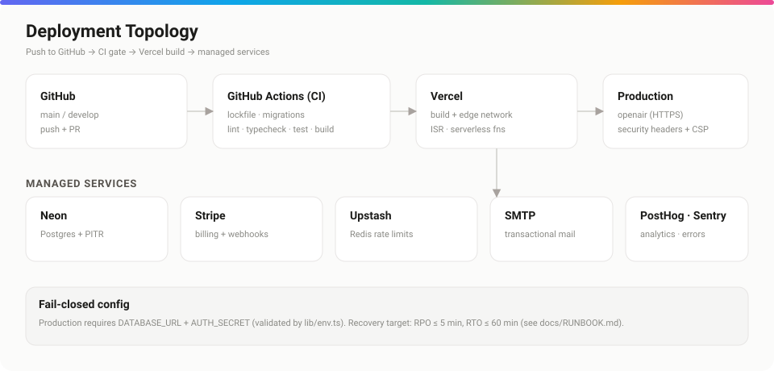

# Deployment

*Shipping Open Air to production — CI, hosting, services, and the release checklist.*



## Purpose

Describe how Open Air goes from a push to a running production deployment: the CI gate, the host, the managed services, and what must be true before you tag a release.

## Overview

Open Air targets **Vercel** (Next.js host) with **Neon Postgres** and managed services (Stripe, Upstash, SMTP, PostHog/Sentry). Every push is gated by **GitHub Actions** before it can deploy.

## Detailed explanation

### CI pipeline (`.github/workflows/ci.yml`)

Three jobs run on every push/PR:

1. **lockfile** — `npm install --package-lock-only` then `git diff --exit-code` (the lockfile must be in sync).
2. **migrations** — `npm run db:check` (schema ↔ migration drift).
3. **quality** — `npm ci` → lint → typecheck → unit tests → integration tests → `next build`.

```yaml
quality:
  needs: lockfile
  steps:
    - run: npm ci
    - run: npm run lint
    - run: npm run typecheck
    - run: npm test
    - run: npm run test:integration
    - run: npm run build
```

### Hosting

Vercel builds the app and serves it over its edge network with **ISR** for the catalog and serverless functions for the API/actions. Set the production env (`DATABASE_URL`, `AUTH_SECRET`, Stripe, etc.) in the Vercel project — see [environment.md](./environment.md).

### Database migrations in CD

Run migrations as part of your release (or a deploy hook):

```bash
npm run db:migrate
```

For risky migrations, create a Neon branch first as an instant rollback point.

### Release checklist

- [ ] CI green (lockfile, migrations, quality).
- [ ] `DATABASE_URL` + `AUTH_SECRET` set in production.
- [ ] `npm run db:migrate` applied.
- [ ] First `/sys` admin created (`npm run platform:admin -- create …`).
- [ ] Stripe webhook endpoint registered → `STRIPE_WEBHOOK_SECRET` set.
- [ ] `CSP_ENFORCE="true"` after a clean report window.
- [ ] Sentry + PostHog keys set; events flowing.
- [ ] Upstash configured for distributed rate limits.

## Best practices

- **Regenerate the lockfile on Linux/CI**, not Windows — a Windows lockfile can omit `optional` flags and break `npm ci` on `ubuntu-latest`. Add `npm run verify:lockfile` to a pre-push hook.
- Keep the pipeline **reliably green** — it's a release gate, not a suggestion.
- Promote CSP to enforced only after watching the report stream.

## Notes & common pitfalls

- A stale `package-lock.json` is the single most common CI failure here — see [troubleshooting.md](./troubleshooting.md).
- The production env check is skipped during `next build` and runs when the server boots; a missing required var fails the boot, not the build.

## Related

- [environment.md](./environment.md) · production variables
- [database.md](./database.md) · migration workflow
- [troubleshooting.md](./troubleshooting.md) · CI & build failures
- [RUNBOOK.md](./RUNBOOK.md) · backups, restore, incident response
