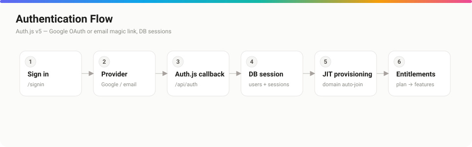

# Security

*The platform's security posture — authentication, multi-tenant authorization, headers, and data handling.*



## Purpose

Document how Open Air protects accounts, tenant data, the admin plane, and user-generated content, and where the trust boundaries are.

## Overview

Security is layered: strong credential handling, server-derived authorization on every sensitive path, an isolated admin plane, hardened HTTP headers, and XSS-safe rendering of user content. The model assumes the client is hostile.

## Detailed explanation

### Authentication & the admin plane

Application auth uses Auth.js with DB sessions. The platform-admin plane is **fully isolated** (separate store, sessions, login) with **scrypt** password hashing, **mandatory TOTP 2FA**, **rate-limited** login, and revocable sessions. Every privileged action is written to an append-only `audit_logs` table, viewable at `/sys/audit`. See [authentication.md](./authentication.md).

### Multi-tenant authorization (OWASP #1)

Every org-scoped route resolves the organization from its slug and checks the caller's membership/role **in that org** before acting:

```ts
// Pattern used across team routes
const org = await getOrgBySlug(slug);
if (!org) notFound();
const role = await getMembership(org.id, user.id);   // null = not a member → 404
if (role !== "owner" && role !== "admin") notFound();
// …mutation, then audit-log it
```

Owner-protection invariants hold (you can't demote or remove the last owner; admins can't remove owners). All queries are `orgId`-scoped, so cross-tenant IDOR isn't reachable.

### User-generated content & XSS

Community content is rendered by React, which auto-escapes — there's no `dangerouslySetInnerHTML` in community components. Inputs are server-bounded (names, descriptions capped; hexes regex-validated; handles slugified). Profile `website` URLs are validated to **`http(s)` only** at input *and* render, closing the `javascript:` vector.

### HTTP headers & CSP

`next.config.ts` sets HSTS, `X-Frame-Options`, `X-Content-Type-Options: nosniff`, `Referrer-Policy`, and `Permissions-Policy`. CSP ships **Report-Only** until you set `CSP_ENFORCE="true"` after confirming a clean report stream.

### Rate limiting & denial-of-wallet

The public API, the token-sync endpoint, and the `/sys` login are rate-limited (Upstash when configured, per-instance memory otherwise). The AI endpoint also carries a daily budget ceiling.

### Secrets

`.env.local` is git-ignored. All env is validated by `lib/env.ts`; production **fails closed** without `DATABASE_URL` + `AUTH_SECRET`.

## Best practices

- Enforce CSP (`CSP_ENFORCE=true`) in production after watching reports; move toward nonce-based to drop `'unsafe-inline'`.
- Configure Upstash in production so rate limits are global across instances.
- Keep platform-admin 2FA mandatory; revoke unknown sessions promptly.
- Report vulnerabilities privately — see [../SECURITY.md](../SECURITY.md).

## Notes & common pitfalls

- **Don't expose secrets via `NEXT_PUBLIC_`.** That prefix ships to the browser.
- **A leaked sync-token URL grants read access** to that kit's tokens — rotate it from the kit's Live Sync panel if exposed.
- **CSP Report-Only provides no live protection** — it only reports. Enforce it to actually block.

## Related

- [authentication.md](./authentication.md) · auth systems in depth
- [environment.md](./environment.md) · `CSP_ENFORCE`, secrets
- [api.md](./api.md) · API-key auth & rate limits
- [../SECURITY.md](../SECURITY.md) · responsible disclosure
